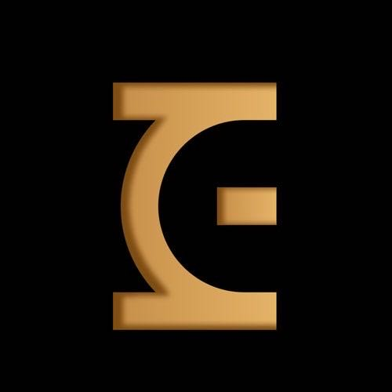

The passing on of reliable knowledge and having ready access to them has been a journey transcending throughout human history. Knowledge graph has proven to be a game-changing knowledge database, laying the foundation for many of today’s technology advancement e.g. question answering systems and Artificial Intelligence (AI). However, the traditional construction of a quality and reliable knowledge graph is met with many challenges from aspects of labour, time and centralization. Also, most information today is stored in unstructured forms such as graphics, audio, video, etc - suitable for human reading, but machines are unable to understand. As a result, the market is dominated by huge IT companies who have the resources to build these knowledge graphs and centralization gives them control of prior knowledge at their free will and limitation to who they want to share it with. At EpiK Protocol, we envision to build an everlasting knowledge vault by applying blockchain technology and crowdsourcing efforts to construct a global collaborative decentralized knowledge graph. Coupled with the use of smart contracts and a native protocol token (called “EPK”), blockchain technology is utilized to improve the transparency, immutability, accountability of a new and more reliable decentralized Knowledge Graph, ensuring all trusted contributors are rewarded for their contributions.

# go-epik

go-epik is an implementation of the EpiK Distributed Storage Network. For more details about EpiK, check out the [Epik Wiki](https://github.com/EpiK-Protocol/wiki).

## Building & Documentation

For instructions on how to build go-epik from source, please visit the source [here](https://github.com/EpiK-Protocol/go-epik/tree/master/documentation).

## Development

All work is tracked via issues. An attempt at keeping an up-to-date view on remaining work is in the [Epik Wiki](https://github.com/EpiK-Protocol/wiki).

## License

Dual-licensed under [MIT](https://github.com/EpiK-Protocol/go-epik/blob/master/LICENSE-MIT) + [Apache 2.0](https://github.com/EpiK-Protocol/go-epik/blob/master/LICENSE-APACHE)
